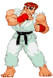
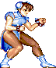
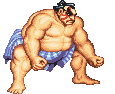
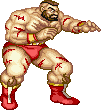
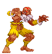

# Projeto Street Fighter

Projeto simples em desenvolvimento que simula personagens do universo Street Fighter com atributos de combate (vida, força e defesa).  
Cada personagem está representado com um GIF animado e suas estatísticas básicas.

---

## 🎮 Personagens

| Personagem | GIF | Vida | Força | Defesa |
|-----------|-----|------|-------|--------|
| **Ryu** |  | 100 | 15 | 7 |
| **Ken** |  | 100 | 14 | 7 |
| **Blanka** |  | 100 | 9 | 10 |
| **Chun-Li** |  | 100 | 9 | 8 |
| **E. Honda** |  | 100 | 8 | 8 |
| **Guile** |  | 100 | 9 | 9 |
| **Zangief** |  | 100 | 8 | 9 |
| **Dhalsim** |  | 100 | 8 | 9 |
| **M. Bison** |  | 105 | 12 | 9 |

---

## ⚙️ Estado do Projeto

🚧 **Em construção**  
Este projeto está em fase inicial. A lógica de combate e interface ainda serão implementadas.

---

## 📁 Estrutura

